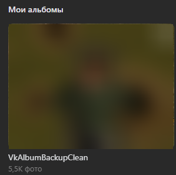

# VkAlbumBackup

## Скачивание или удаление всех фотографий из ВК.

Это приложение позволяет вам скачать все фото из ваших альбомов или же очистить альбом от всех фото. Функция очистки в основном полезна для сохранённых фотографий, которые ВК не позволяе удалить простым способом.

### Перейдите по ссылке для получения последней актуальной версии приложения - [Скачать](https://github.com/Shark-vil/VkAlbumBackup/releases/latest)

## Функции

- Скачивание всех фото из альбома
- Очистка альбома.

## Примечание

Для очистки фото создаётся отдельный приватный альбом, куда перемещаются все фото. Этот процесс занимает достаточное количество времени из-за ограничений ВК.

### Если после перемещения всех фото не удалось удалить альбом, возможно сработала защита ВК. Попробуйте удалить альбом вручную через 24 часа.

## Защита данных

Токен API сохраняется в файле **token.dat**, который создаётся после авторизации в том-же месте где и **.exe** файл. Токен шифруется согласно установленному вами *PIN-коду*. Сам *PIN-код* нигде не сохраняется. Для большей безопасности, вы можете переместить файл **token.dat** в облачное хранилище, и заново скачать его, когда приложение вам понадобится.
